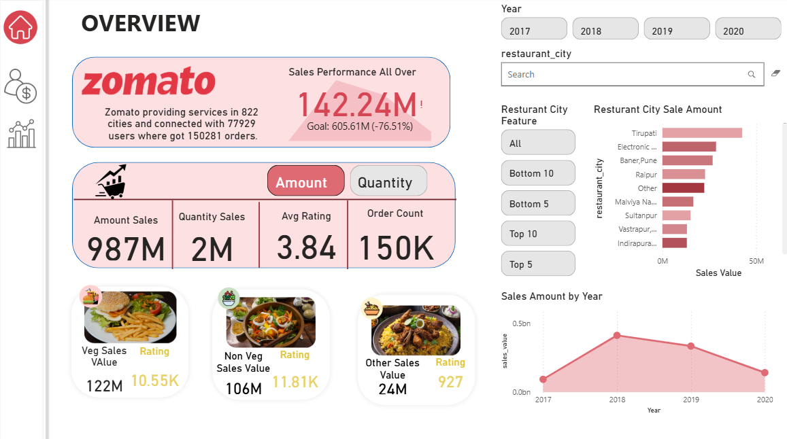
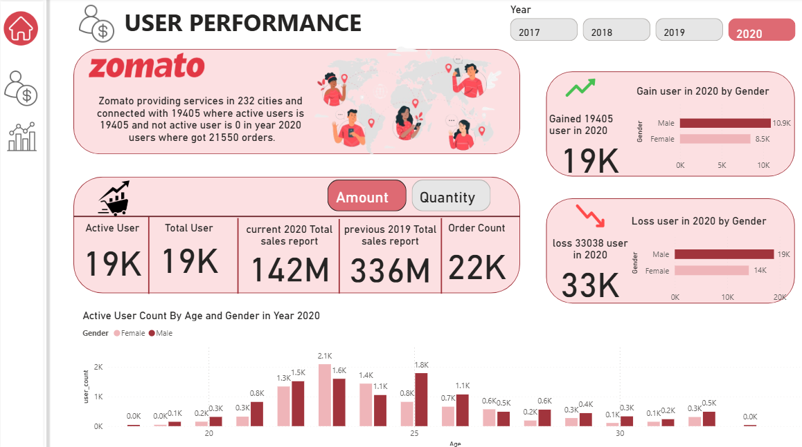
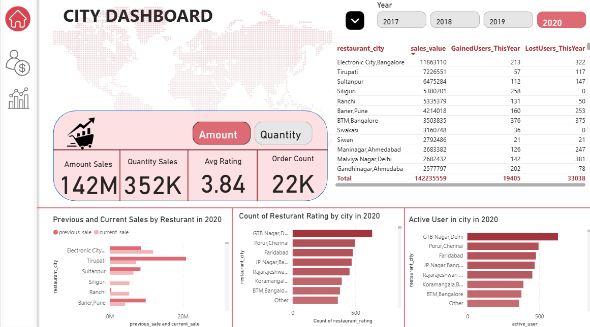
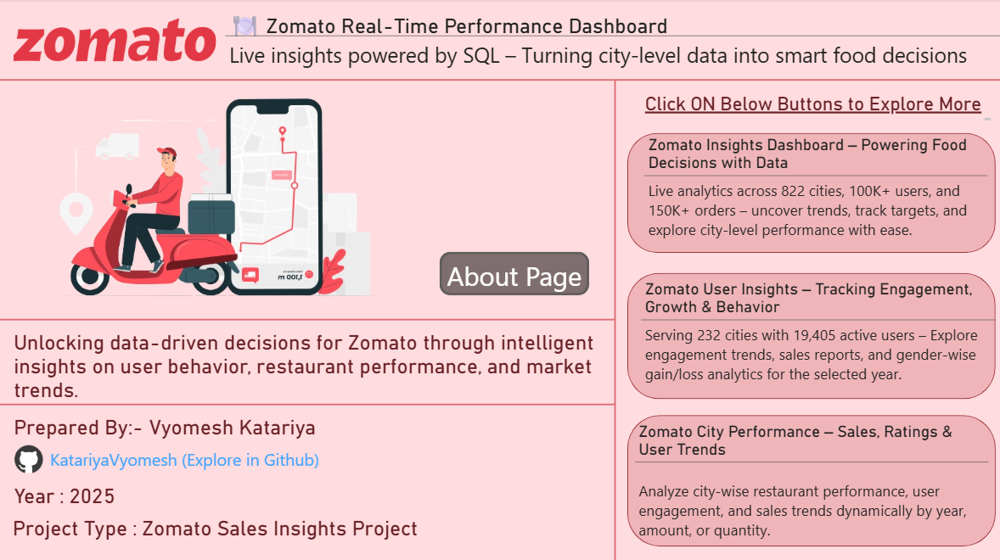
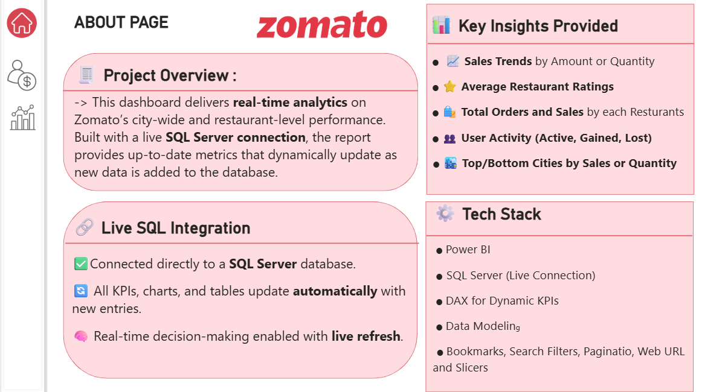

# 🍽️ Zomato Real-Time Analytics Suite



> **“Transforming raw data into restaurant-ready revenue strategies – one click at a time.”**

A powerful, enterprise-grade **Power BI analytics solution** integrated with **live SQL Server data**, delivering actionable insights into **Zomato’s operations across 800+ Indian cities**.

---

## 📚 Table of Contents

1. [📌 Project Overview](#-project-overview)  
2. [🚀 Key Features](#-key-features)  
3. [📊 Dashboard Walkthrough](#-dashboard-walkthrough)  
   - [🔹 Index Page](#-index-page)  
   - [👤 User Engagement Dashboard](#-1-user-engagement-dashboard)  
   - [💸 Sales Performance Dashboard](#-2-sales-performance-dashboard)  
   - [🏙️ City Analytics Dashboard](#-3-city-analytics-dashboard)  
4. [⚙️ Technical Implementation](#-technical-implementation)  
5. [🧮 DAX Measures Used](#-dax-measures-used)  
6. [📈 Sample Insights](#-sample-insights)  
7. [🖼️ Screenshots](#-screenshots)  
8. [ℹ️ About Page](#-about-page)  
9. [🔧 Setup Power BI Dashboard Project](#-setup-power-bi-dashboard-project)  
10. [👤 Author](#-author)  

---

## 📌 Project Overview

The **Zomato Real-Time Analytics Suite** is a fully interactive, real-time **Business Intelligence dashboard** built using **Power BI** with **DirectQuery** mode from **SQL Server**.

It enables business teams to:

- Monitor **user engagement trends**
- Track **sales performance and growth**
- Segment performance by **food category (Veg/Non-Veg)**
- Drill down by **city and restaurant**
- Make **data-driven decisions** using refreshable, real-time reports

---

## 🚀 Key Features

- ✅ **Live SQL Server Integration** (DirectQuery)
- ✅ **20+ Dynamic DAX Measures**
- ✅ **Real-Time KPIs, Charts & Trends**
- ✅ **Drilldowns by City → Restaurant**
- ✅ **Dynamic Bookmarks and Slicers**
- ✅ **YOY Comparisons & Target Trackers**

---

## 📊 Dashboard Walkthrough

### 🔹 Index Page
- Project Title & Tagline  
- Navigation Buttons (Overview, User Engagement, City Analytics, About)  
- Footer with Author, Year, GitHub Link  

---

### 🔹 1. User Engagement Dashboard  


This dashboard provides an in-depth analysis of **Zomato's user base**, helping stakeholders understand how users interact with the platform.

#### 🔍 Key Features:
- 👥 **Total / Active / Inactive Users**  
  Track overall platform usage and distinguish between retained and churned users.

- 📊 **Demographic Segmentation (Age, Gender)**  
  Visualize user distributions to identify core user personas.

- 📈 **Year-over-Year (YOY) User Gain/Loss**  
  Analyze user acquisition and attrition trends compared to previous years.

- 🔁 **Monthly Active User (MAU) Trends**  
  Time-series trends to spot seasonal engagement patterns.

#### 🎯 Business Value:
- Gain insight into **user behavior and retention**
- Drive **targeted marketing** using age/gender filters
- Identify **churn risks** and high-growth demographics

---


### 🔹 2. Sales Performance Dashboard  

This dashboard focuses on **revenue performance and product demand**, segmented by time, region, and food category.

#### 🔍 Key Features:
- 💰 **Sales KPIs (Current vs Previous Year)**  
  Dynamic KPI cards showing revenue performance and growth status.

- 🥗 **Category-Wise Sales (Veg vs Non-Veg)**  
  Compare item-wise contributions to overall sales through pie charts and bar graphs.

- 📦 **Order Volume vs. Order Value**  
  Visual differentiation of high-order-volume vs. high-revenue items.

- 📉 **YOY Sales Trendlines & Target Tracking**  
  Track sales against predefined targets (e.g., +18%) using line charts and indicators.

#### 🎯 Business Value:
- Identify **high-margin vs high-volume** product lines
- Track **sales trends and seasonality**
- Make informed decisions on **discounts, promotions, and pricing**

---

### 🔹 3. City Analytics Dashboard

Dive deep into **geographic performance insights**, helping Zomato understand regional dynamics and optimize operations.

#### 🔍 Key Features:
- 🏙️ **Top/Bottom Cities by Sales & Orders**  
  Use filters and bar charts to instantly spot top-performing and struggling cities.

- ⭐ **Restaurant Ratings by City**  
  Understand service quality by analyzing user ratings at the city and restaurant levels.

- 🧭 **City → Restaurant Drilldown Functionality**  
  Clickable hierarchy-based visuals that drill from city-wide metrics to individual restaurant insights.

- 📍 **User Growth by Region**  
  Track expansion, decline, or saturation using trend charts and maps.

#### 🎯 Business Value:
- Identify **market expansion** opportunities
- Optimize **logistics and resource allocation**
- Improve **restaurant-specific performance** using regional comparisons
---

## ⚙️ Technical Implementation

| Feature                | Technology Used                |
|------------------------|--------------------------------|
| 💾 Data Source          | SQL Server (DirectQuery Mode)  |
| 📊 Visualization        | Power BI Desktop / Service     |
| 🧠 Data Modeling        | DAX (Data Analysis Expressions)|
| 🖱️ Interactivity        | Slicers, Bookmarks, Buttons    |
| ☁️ Deployment           | Power BI Web Service           |

---
# Power BI Dashboard Measures and Dynamic Elements

## 🧮 DAX Measures Used

| Measure Name                   | Purpose                                                                 |
|--------------------------------|-------------------------------------------------------------------------|
| Total Users                    | Total number of users in the system                                     |
| User Count                     | Count of users from fact table (used in visuals)                       |
| Active User                    | Number of users with activity in the selected period                   |
| Non Active User                | Users who have not placed any order in the given time frame            |
| Monthly Active User            | Filters users who placed orders in the selected month                  |
| Gain User (Year Wise)          | Users gained compared to the previous year                             |
| Loss User (Year Wise)          | Users lost or became inactive vs. previous year                        |
| Sales Value                    | Total sales amount across orders                                       |
| Order Count                    | Total number of orders completed                                       |
| Count_Order Value              | Variant of order count used for bar/line visuals                       |
| Average Rating                 | Mean rating for restaurants in the selected city or period             |
| Current Year                   | Extracts the currently selected year                                   |
| Previous Year                  | Returns previous year from selected/current value                      |
| Year_Value                     | Used for syncing visuals with slicer selections                         |
| Current Sales                  | Filters total sales amount for the current year                         |
| Previous Year Sales            | Filters sales amount for the previous year                             |
| Target Sales (18% over previous)| Previous Year Sales * 1.18 for goal comparison                        |
| Top_Bottom_N_Sale              | Ranks restaurant cities by sales/quantity for Top-N analysis           |

## 📊 Dynamic Titles & Text Elements

| Measure Name                           | Purpose                                                                 |
|----------------------------------------|-------------------------------------------------------------------------|
| Dynamic KPI Title                      | Changes KPI card title based on selected year or filter                |
| Dynamic Current Sales Title            | Adjusts "Current Sales" card title dynamically                         |
| Previous Sale Title Dynamic            | Shows dynamic label for previous year sales comparison                 |
| Dynamic Subheading                     | Auto-subtitle below page titles (varies by selected dimension like year/city) |
| Dynamic User Subheading                | Specific to user dashboard subtitle                                    |
| Dynamic Active User Count by Age Title | Title for active user age/gender chart                                 |
| Dynamic Sales Values Line Graph Title  | Title for year-over-year sales trend chart                             |
| Dynamic_Top_Bottom_Title               | Used in "Top/Bottom Restaurant by Sales" visuals                       |
| Dynamic Gain User Bar Graph Title      | Title for user acquisition chart                                       |
| Dynamic Loss User Bar Graph Title      | Title for user churn chart                                             |
| Dynamic GainUser Title                 | Display title for KPIs or visuals related to gainers                   |
| Dynamic LossUser Title                 | Display title for KPIs or visuals related to churners                  |

---

## 📈 Sample Insights

- 📍 **Ahmedabad** reported **₹15.2M** in revenue (2020) with an average rating of **4.3★**  
- 🚀 Gained **2,000+ new users** in metro cities  
- 🥇 **Urban Eatery** topped revenue contribution charts  
- 🍗 **Non-Veg** items made up **58% of total orders** in Tier-1 cities  

---

## 🖼️ Screenshots

| Section                | Preview                          |
|------------------------|----------------------------------|
| Index Page             |        |
| About Section          |        |
| Overview Dashboard     |  |

---

 
## ℹ️ About Page

### 📋 What is this Project About?

The **Zomato Real-Time Analytics Suite** is a scalable, real-time Power BI solution that empowers data-driven decision-making by transforming operational data into actionable insights.

Built with **live SQL integration (DirectQuery)**, this suite of dashboards is designed for Zomato’s stakeholders to:

- ✅ Monitor **key business metrics** across 800+ Indian cities  
- ✅ Understand **user behavior**, demographic trends, and churn risks  
- ✅ Track **sales growth** across categories (Veg/Non-Veg) and locations  
- ✅ Evaluate **restaurant-level performance** using ratings and revenue data  
- ✅ Set and monitor **realistic performance targets** based on historical trends

This end-to-end BI system bridges the gap between raw data and informed decisions.

---

### 🧭 Navigation Buttons

For easy navigation, the dashboard includes interactive buttons that link across the suite:

- 🔄 **[Project Overview](#project-overview)** – High-level summary of all key KPIs  
- 👤 **[User Performance Dashboard](#1-user-engagement-dashboard)** – Tracks user activity and demographics  
- 🏙️ **[City Sales Analytics Dashboard](#3-city-analytics-dashboard)** – Breaks down city-level metrics and growth  
- ℹ️ **[ℹAbout Page](#about-page)** – Current section

These buttons are configured using **Power BI bookmarks**, ensuring seamless interactivity and report storytelling.

---

### 🧠 Why This Project Matters

In the food-tech space, **speed, precision, and localization** are key to staying competitive. This analytics suite enables Zomato to:

- Spot **growth opportunities**
- Eliminate **underperforming SKUs or locations**
- Optimize **user acquisition and retention strategies**
- Align **business targets** with ground-level performance data

Whether you're a **product head**, **marketing strategist**, or **regional manager**, this dashboard delivers the data you need — **when you need it**.

---

### 💡 Why This Project Helpful:

**"Turning food delivery data into intelligent decisions—faster, sharper, smarter."**
**"Where real-time insights meet restaurant success."**
**"From SQL to sales strategy—your data, served hot."**
**"Delivering data-driven decisions for every bite."**
**"Powering Zomato’s future with every data point."**
**"Feeding business growth through live analytics."**
**One dashboard. Infinite decisions. Real-time power."**
**"Transforming live data into high-impact restaurant intelligence."**

---

## 🔧 Setup Power BI Dashboard Project

### 1️⃣ Prerequisites
- Power BI Desktop (latest)
- SQL Server connection credentials
- Dataset with order, user, rating, and location information

### 2️⃣ Steps to Launch

```bash
# Step 1: Clone the Repository
git clone https://github.com/VyomeshKatariya/Zomato-PowerBI-Dashboard.git

# Step 2: Open the .pbix file in Power BI Desktop
# Step 3: Go to Transform Data → Edit Parameters → Set SQL Connection
# Step 4: Ensure DirectQuery Mode is maintained
# Step 5: Review Measures, Visuals, Filters
# Step 6: Publish to Power BI Service (optional)
```

### 3️⃣ Optional
- Add RLS (Row-Level Security)
- Connect via Power BI Gateway
- Integrate alert-based emails or usage metrics

---

## 👤 Author

**Vyomesh Katariya**  
🎓 *Data Analyst | BI Developer | Power Platform Enthusiast*  
🔗 [GitHub Profile](https://github.com/VyomeshKatariya)  
📅 Year: 2025  
📂 Project Type: Power BI | Live SQL | Real-Time Dashboards  
